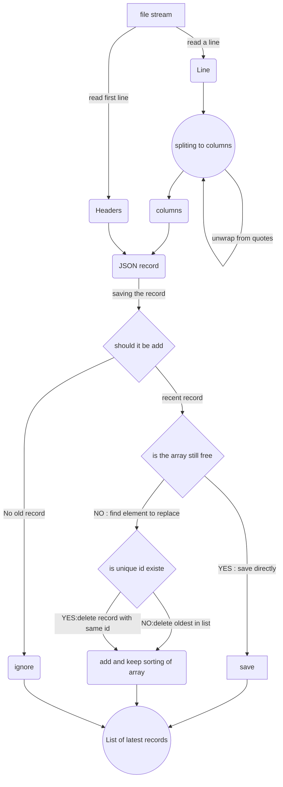

# Big CSV to Json extractor

this script allows to handle big CSV files that can't be used directly and extract only desired records.

**used solution** : stream reading and line by line processing

please notice that this is the script version. and that two other version are available in different setups : 
    
- library version that can be found under : 
    - github link :
    - npm link : 
  

- Commande Line that can be found under :
    - github link :
    - npm link :


## Usage : 
the script version of it consiste of two files : main.js and helpers.js

the main.js contains the main functions and the even more important CONSTANTES that will allow to configure 
the execution of the script such as : 

- ```FILE_NAME = 'data.csv'; ```  the name of source CSV file.
- ```RESULT_FILE_NAME  = 'users.json';```  the name of result JSON file.
- ```COUNT_OF_RECORDS_TO_SAVE = 1517;```  the count of records to be extracted in the result json file
- ```COUNT_OF_RECORDS_TO_SAVE = 'uid';```  the count of records to be extracted in the result json file
- ```RECORD_UNIQUE_ATTRIBUTES = 'createdAt';```  the column's name to use as unique records id
- ```NUMBER_OF_RECORDS_PROGRESS_DISPLAY  = 10000;```  the interval of records count to display progress in the console

once the configuration done you can launch the script by :

```
- yarn
- yarn extract
```

## Complexity : O(n)
for the complexity of the main algorithm of sorting data and saving only desired records :

- let **"n"** : be the number of lines in the original CSV file
- let **"m"** : be the number of desired records to be extracted  ***COUNT_OF_RECORDS_TO_SAVE***

for each line in the original file we need to sort only **"m"** records at maximum,
and only if the sortingValue is bigger than the latest element of the list.

that give us a global Algorithm with the complexity of : **"O( n x m )"**

and knowing the intended use of the script : m <<< n  which leave us with the complexity of : **"O(n)"**


## Algorithm :
  the algorithm of sorting data and saving only desired records :



