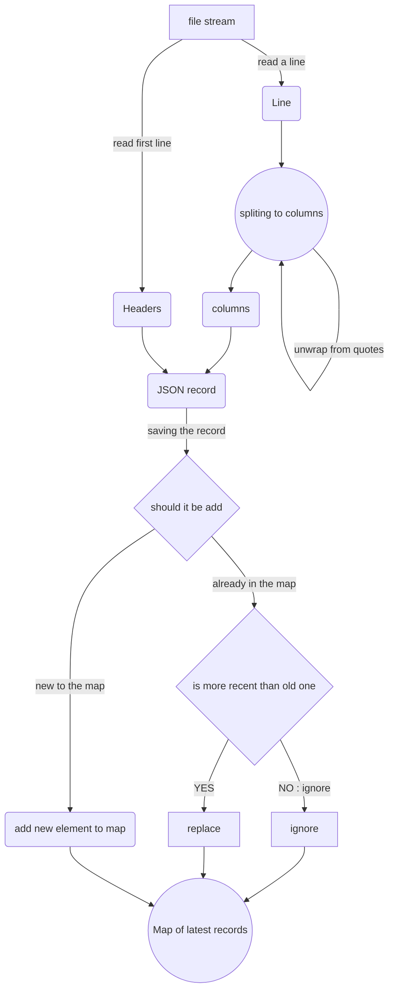

# Big CSV to Json extractor

this script allows to handle big CSV files that can't be used directly and extract only desired records.

**used solution** : stream reading and line by line processing


## Usage : 
the script version of it consiste of two files : main.js and helpers.js

the main.js contains the main functions and the even more important the CONSTANTES that will allow to configure 
the execution of the script such as : 

- ```FILE_NAME = 'data.csv'; ```  the name of source CSV file.
- ```RESULT_FILE_NAME  = 'users.json';```  the name of output JSON file.

once the configuration done you can launch the script with commandes :

```
- yarn
- yarn extract
```

## Complexity : O(n)
for the complexity of the main algorithm of sorting data and saving only desired records :

- let **"n"** : be the number of lines in the original CSV file
- let **"m"** : be the number of desired records to be extracted  ***COUNT_OF_RECORDS_TO_SAVE***

for each line in the original file we have direct access of records at maximum with complexity of **"O(1)""**,
and only if the sortingValue is bigger than the latest element of the list.

that give us a global Algorithm with the complexity of : **"O( n )"**


## Algorithm :
  the algorithm of sorting data and saving only desired records :



